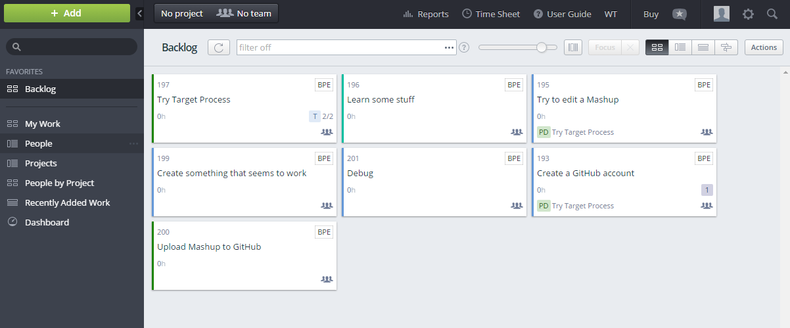
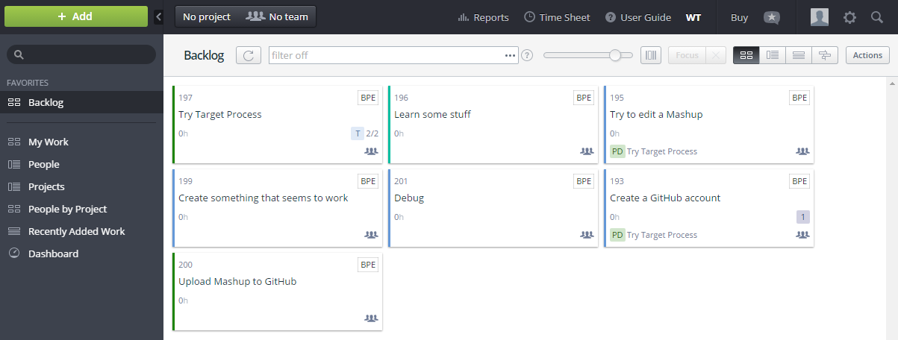

# White background theme

This theme sets the background colour of the main board to white, and the background colour of the top menu to off-white. When the theme is installed, the letter "WT" appear in the menu bar. Click these letters to activate the theme. When the them is activated, these letters are bolded.

### Target Process default theme

### Target Process with White background theme

